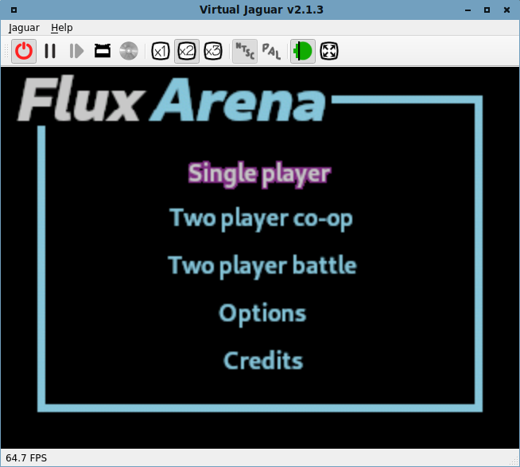

# flux-arena

## Summary

This is my first attempt at creating a game for the [Atari Jaguar video game system](https://en.wikipedia.org/wiki/Atari_Jaguar). 
Accordingly, the scope is narrow: 2D platforming within a single screen arena.

## Dependencies

This game is coded around the [Removers' libraries](http://removers.free.fr/softs/download.php), which supply both a standard 
library implementation for the Jaguar along with middleware for interacting with 
the console's support for things like sprites, animations and sound playback.

